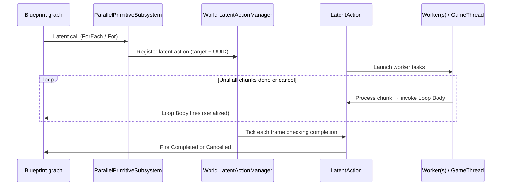

# Architecture

This page describes **how** Parallel Primitive Operations is put together: where state lives, how a parallel loop maps to Unreal’s latent system, and how worker threads interact with your Blueprint graph. You do not need to read C++ to use the plugin, but understanding the model helps when debugging or choosing settings.

---

## 1. Role of `UParallelPrimitiveSubsystem`

### Why a Game Instance subsystem?

The plugin exposes almost all entry points as **`UParallelPrimitiveSubsystem`**, a **`UGameInstanceSubsystem`**.

- **One instance per game instance** — matches the lifetime of a play session (PIE, standalone game, listen server instance, etc.).
- **Stable access from Blueprint** — the graph getter node **`Get ParallelPrimitiveSubsystem`** is the standard entry point in gameplay graphs.
- **Convenient outer for factory objects** — helpers like **`MakeAtomicInt32`** create `UObject` instances owned by the subsystem, so they stay rooted while the subsystem exists.

The header notes that **world context is resolved** so **`FLatentActionInfo`** (the latent “callback ticket” generated by the Blueprint VM) stays consistent and **Completed** can fire on the right graph object.

### What the subsystem does *not* “own” end-to-end

Loop execution state is mostly inside **latent action** subclasses registered with the **world’s** **latent action manager**. The subsystem is the **public API surface** and **spawn point**; the **world** drives **when** latent actions tick via **latent tick**.

### Resolving the subsystem from code

**`GetSubsystemFromContext`** resolves: world context object → `UWorld` → `UGameInstance` → `UParallelPrimitiveSubsystem`.

If any step fails (null world, no game instance, etc.), you get an error message and `nullptr`.

---

## 2. Latent actions and `FLatentActionInfo`

### The Unreal pattern

A **latent** Blueprint node does not finish in one frame. Instead, the VM supplies **`FLatentActionInfo`**, which includes:

- **`CallbackTarget`** — usually the Blueprint object (the Blueprint class instance) that owns the graph.
- **Execution function** — which internal function the Blueprint VM calls when the action completes.
- **Output link** — which exec pin fires when the action finishes.
- **UUID** — unique ID for **this** latent invocation on that target (prevents duplicate registration).

The plugin registers a **latent action** with:

```text
The world latent action manager().registers the loop as a latent action (callback target, UUID, action object)
```

So **the world’s latent manager** ticks the latent action until the loop is done or cancelled, then triggers the the correct branch on the Blueprint that started it.

### One latent action per (target, UUID)

Before registering, the plugin checks whether a latent action is **already running** for the same **target object + UUID**. If so, the new call is **rejected** with a **warning** in the Output Log. In practice:

- Do not start **two** parallel loops from the **same latent execution chain** without waiting for the first to finish, unless they use **different** latent identities (different nodes / flows).
- Typical graphs: **Completed** fires, then you can start another loop safely.

### Loop completion vs cancel

On each game-thread latent tick, the loop checks for completion and cancellation:

1. If **cancel** is requested → signals **Cancelled** (exactly once) → latent completion fires with branch **Cancelled**.
2. Else if all iterations are accounted for → signals **Completed** (exactly once) → resume with **Completed**.

The completion signal is **idempotent** (atomic “only one winner”) so the terminal branch is not signaled twice.

---

## 3. Shared loop state

All typed **ForEach** variants, **Parallel For**, and the chunk scheduler share a **single shared state** object. Think of it as the **single source of truth** for one running loop.

It tracks, among other things:

| Concern | Purpose |
|--------|---------|
| **Callback target + completion info** | Who to notify when firing **Loop Body** and when finishing. |
| **Branch and Index variables** | Blueprint-visible enum branch and iteration variables. |
| **Resolved options** | Effective **policy**, **chunk size**, **max concurrency**, **log** flag (from node + [Developer Settings](09-Developer-Settings.md)). |
| **Total iteration count / chunk count** | How many iterations; how many chunk slots exist. |
| **Next chunk counter (atomic)** | Workers **claim** the next chunk index without locks. |
| **Completed iteration counter (atomic)** | How many **iterations** finished (each index increments once). |
| **Active worker counter (atomic)** | How many worker tasks were started; decremented when a worker exits its loop. |
| **Stop / terminal flags** | Cooperative shutdown and “fire **Completed**/**Cancelled** only once”. |
| **Cancel flag** | Shared flag from **`UParallelCancelToken`**, if one was passed. |
| **Blueprint invoke lock** | **Write lock** around **the Loop Body invocation** so two workers cannot corrupt shared Blueprint state (which would “tear” Blueprint state or output variables. |

**Important for readers:** Even with many CPU threads, **only one Loop Body invocation runs at a time** in Blueprint. Parallelism still helps when the **body is cheap** in Blueprint and you have **many** indices, because workers process different chunks simultaneously while Blueprint callbacks are serialized — but Blueprint itself is never re-entrant across threads.

---

## 4. Chunk scheduling and workers

### Chunks

The array (or synthetic range for **Parallel For**) is treated as **`TotalCount`** elements indexed **`0 … TotalCount - 1`** internally. For **Parallel For**, **`FirstIndex`** is added when calling into your **Loop Body** so the **Index** pin matches the logical range.

- **`ChunkSize`** (resolved from the pin or defaults) defines how many **consecutive** indices belong to one **chunk**.
- **`NumChunks` = ceil(TotalCount / ChunkSize)** (with sensible handling for empty input).

### How each worker runs

Each worker repeatedly:

1. Atomically claims the **next available chunk** (if no chunks remain, the worker exits).
2. For each index in that chunk, if not stopping:
   - Invokes the Blueprint **Loop Body** for that index (serialized so only one runs at a time).
   - Increments the completed iteration counter.

So **within a chunk**, order is **sequential**. **Across chunks**, different workers may run **simultaneously**.

### Starting workers

After building the loop's shared state, the plugin launches worker tasks:

- If **`TotalCount == 0`**, it **returns without starting workers**. The latent action’s **latent tick** then sees **`IsComplete()`** true and fires **Completed**—no iterations run.
- Otherwise chooses **`WorkerCount`** and **where** tasks run from **`EParallelExecutionPolicy`** (and **Force on Game Thread** override):

| Policy | Worker tasks | Typical thread |
|--------|----------------|----------------|
| **Parallel Workers** | Up to **Max Concurrency** (clamped by chunk count) | Engine thread pool |
| **Worker Single Thread** | **One** task | Same thread pool, **one** concurrent worker |
| **Game Thread** | **One** task | Game thread (via async task dispatch) |

Each task processes chunks until no chunks remain or stop is requested.

---

## 5. Typed ForEach internals (Int, Float, …)

**The typed ForEach implementation** **copies** the incoming array into a **snapshot** at loop start.

Why snapshot?

- Avoids races if the **original** array is mutated on the game thread while workers read it.
- Each iteration receives the **element value from that snapshot** for the given index.

So you see **consistent per-iteration values** for the captured array **as it was when the loop started**.

---

## 6. Parallel For index mapping

The **Parallel For** loop sets its iteration count to `LastIndex - FirstIndex + 1` when `LastIndex >= FirstIndex`, otherwise zero.

Workers use internal slot indices `0 … TotalCount-1`; each is converted to `FirstIndex + slot` so the **Index** pin in **Loop Body** matches the inclusive range you passed in.

---

## 7. Execute Parallel Body (different shape)

**`ExecuteParallelBody`** uses a **different**, simpler internal model (no chunk loop):

1. On start, **`Continue`** is invoked **on the game thread** (with a lock so it does not overlap other calls).
2. Then **`Body`** is scheduled either on the **game thread** or the **thread pool** depending on **Force On Game Thread**.
3. The latent action waits until **Body** finishes, then signals **Completed**.

So you get **one** **Body** invocation, not a per-index loop. When **Log** is enabled, the plugin notes which thread ran **Body** in the Output Log.

---

## 8. Factory objects (atomics, buffers, cancel tokens)

Subsystem factory methods (**`Make Cancel Token`**, **`Make Atomic Int32`**, etc.) create **`UObject`** instances owned by the subsystem. They are normal UE objects subject to **garbage collection**; keep a reference in a Blueprint variable to prevent them from being collected while in use.

**Cancel tokens** internally hold a shared flag that workers and the latent tick can read thread-safely without accessing the UObject from background threads.

---

## 9. Settings in the architecture

**Plugin project settings** supply defaults for:

- **Default execution policy**
- **Default chunk size** (used when the node pin is `0`)
- **Default max concurrency** (combined with node override and auto worker count — see [Execution parameters](08-Execution-Parameters.md))

**Force Parallel On Game Thread** on nodes overrides policy to **Game Thread** for that single invocation.

---

## 10. Flow diagram (high level)



---

## 11. Mental model checklist

- **Subsystem** = public API + object factory; **world latent manager** = drives completion ticking.
- **Parallelism** = multiple **chunk consumers** running simultaneously; **Blueprint Loop Body** invocations are **serialized** by an internal lock.
- **Typed ForEach** = **array snapshot** at start.
- **Empty loop** = **no workers started**, latent completion still reaches **Completed**.
- **Duplicate latent UUID** on same target = **second start ignored** with a warning.

---

## 12. Related pages

- **[Developer Settings](09-Developer-Settings.md)** — where global defaults (policy, chunk size, concurrency) come from.
- **[Execution parameters](08-Execution-Parameters.md)** — chunk size, concurrency, force game thread.
- **[Thread safety](14-Thread-Safety.md)** — what belongs in **Loop Body** given real worker threads.
- **[Overview](01-Overview.md)** — product-level limits and glossary.
- **[Quick start](03-Quick-Start.md)** — first graph wiring.
